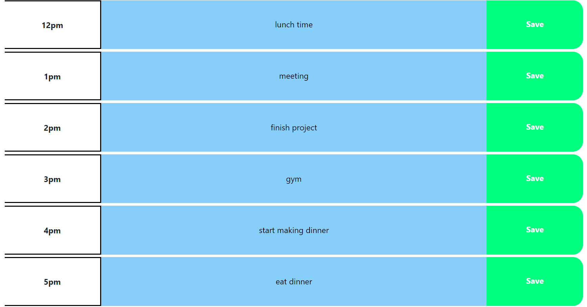

# Day-Planner
<h1>Purpose</h1>

In this application, the user is able to keep a schedule from the hours of 9am to 5pm. The user is able to input information that can be saved within each hour block. This will allow for anyone to easily keep track of what they have planned for those hours whether it be at work or not. As the day progresses, the boxs will be color coordinated based on the hour of the day. If it its the current time, the box will show red, if the time has passed, the box will be gray, and if the time is in the future, the box will remain blue. The information saved be stay saved in that time slot until the user either manually resets it with the restart your day button, or when the time passes and turns gray; The input will read "Past".

